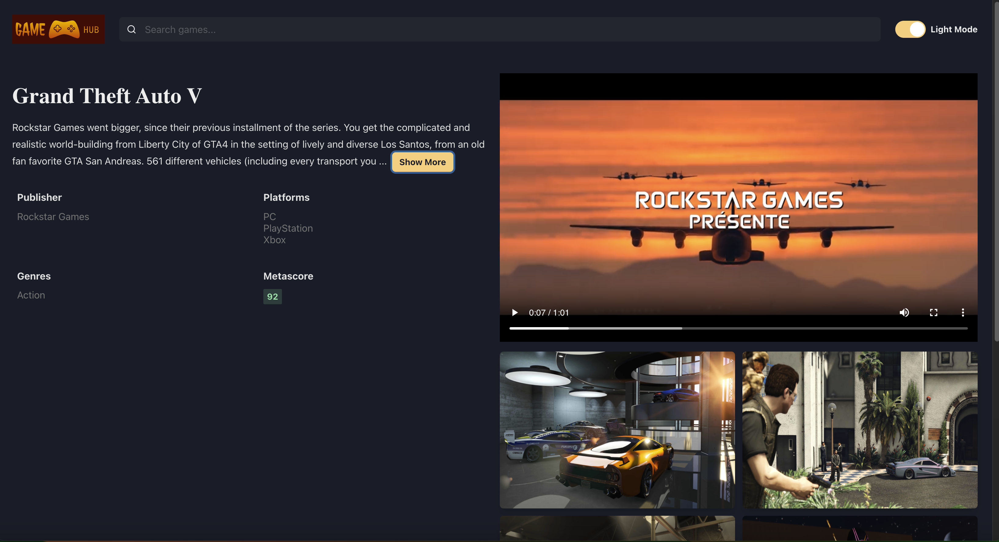

# Game Hub App

This project is a responsive gaming web application built using React with TypeScript. It utilizes Chakra UI for styling, React Router for navigation, React Query for fetching and caching HTTP request data, and Zustand for global state management.

## Live Demo
Check out the live demo of the application <a href="https://game-hub-blush-mu.vercel.app/">here</a>

## Screenshots

## Features

<ul>
  <li>Responsive Design: Adapts to various screen sizes for optimal user experience.</li>
  <li>Platform Filtering: Allows users to filter games based on platforms.</li>
  <li>Genre Filtering: Enables users to filter games by genre.</li>
  <li>Sorting and Ordering: Users can sort games based on different criteria.</li>
  <li>Search Functionality: Provides a search feature to find specific games.</li>
  <li>Infinite Scrolling: Loads games dynamically as the user scrolls down.</li>
  <li>Data Fetching and Caching: Efficiently fetches and caches data using React Query.</li>
  <li>Global State Management: Manages global state using Zustand.</li>
  <li>Video and Image Handling: Caches and displays game-related media content.</li>
</ul>

## Technologies Used

<ul>
  <li>React: A JavaScript library for building user interfaces.</li>
  <li>TypeScript: A typed superset of JavaScript that adds static types.</li>
  <li>Chakra UI: A simple, modular, and accessible component library.</li>
  <li>React Router: A library for routing in React applications.</li>
  <li>React Query: Data fetching library that simplifies fetching, caching, synchronizing, and updating server state.</li>
  <li>Zustand: A small, fast, and scalable bearbones state-management solution.</li>
</ul>
